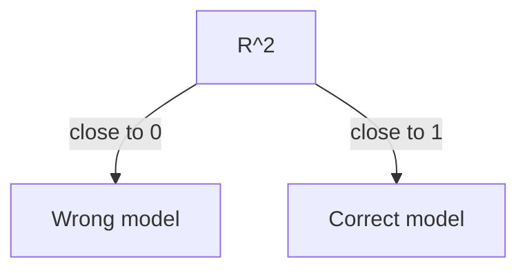

2022/07/26  (10:58)
from: [[3.1.2 ASSESSING THE ACCURACY OF COEFFICIENT ESTIMATES]]
to:[[Ch-3 Linear Regression]]

### 3.1.3 ASSESSING THE ACCURACY OF THE MODEL:
Quality of FIT is mostly assessed using these 2 :
- RSE
- R2 statistic

#### RSE:
Each observation has a certain error: $\epsilon$.
RSE is a measure of the *standard deviation* of $\epsilon$.

>Roughly speaking, it is the average amount that the response will deviate from the true regression line

![[Pasted image 20220726112703.png]]

RSE is considered the measure of *lack of fit of the model.*
RSE is:
1. Absoute
2. measured in UNITS of y

#### $R^2$ STATISTIC:
$R^2$ statistic is a proportion (*proportion of variance*). **Always between 0-1**.
$$
R^2=\frac{TSS-RSS}{TSS}=1-\frac{RSS}{TSS}----(3.9)
$$
Where the TSS is the total sum of squares.
$$
TSS=\sum\limits_{i=1}^n(y_i-\bar{y})^2----(3.10)
$$
| TSS                                                                                                                                                    | RSS |
| ------------------------------------------------------------------------------------------------------------------------------------------------------ | --- |
| measures the total variance in response Y, and can be thought of as the amount of variability inherent to the response BEFORE REGRESSION was performed | Amount of variability left AFTER the regression was performed    |

>RSS measures the proportion of variability in Y that can be explained using X.

>[!important]
>check out [[CORRELATION]]

