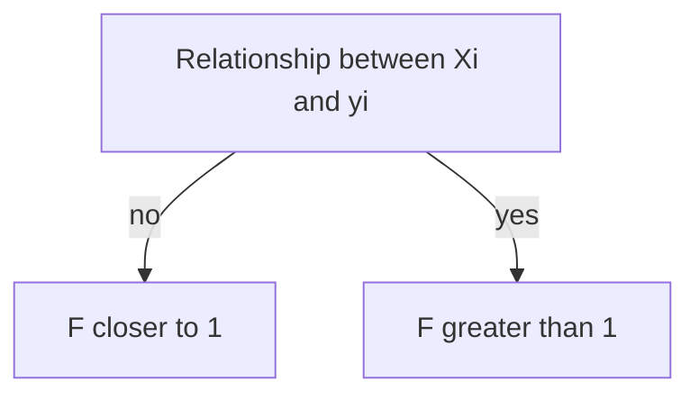

2022/07/26  (12:43)
from: [[3.2.1 ESTIMATING THE REGRESSION COEFFICIENTS]]
to: [[Ch-3 Linear Regression]]

### 3.2.2 SOME IMPORTANT QUESTIONS:
We need to ask 4 questions:
1. Is atleast one of the predictors X1,...,Xp useful in the prediction?
2. Do all predictors help explain Y? or only a  subset?
3. How well is the fit of the model?
4. Given a set of X, what Y should we predict? and how accurate is it?

#### 1. IS THERE A RELATIONSHIP BETWEEN THE RESPONSE AND THE PREDICTORS?
We check this using the *NULL hypothesis*.
$$
\begin{gather*}
H_0=\beta_0=\beta_1=....=\beta_p=0\\
H_a=\text{at least one } \beta_{j}\text{ is non-zero}
\end{gather*}
$$

Computed using the [[F-STATISTIC]]:

$$
F=\frac{(TSS-RSS)/p}{RSS/(n-p-1)}----(3.14)
$$

	The F-statistic, as we can see also depends on n and p

Some more properties:
1. *Smaller n*--> needs larger F-stat to reject $H_0$
2. *Large n*--> slightly larger F is good enough to disproove $H_0$
3. When the $H_0$ is true, and errors $\epsilon_i$ have a normal distribution, the F-statistic follows an F-distribution. 
4. We can compute this using any statistical software, and then use the p-value generated from there to accept or reject $H_0$.

We might want to test a particular sub-set *q* of the entire p. Here, we choose a model which fits all the variable except those last q.s
$$
\begin{gather*}
H_0=\beta_{p-q+1}=\beta_{p-q+2}=.....\beta_{p=0}\\
\text{with the appropriate RSS for that section being }{RSS_0}\\
F=\frac{(RSS_0-RSS)/q}{RSS/(n-p-1)}----(3.15)
\end{gather*}
$$
##### given the individiual t-stat and  p-values, why do we look at the overall F-stat?
there are 2 reasons:
1. the individual p-values tell us about the relationship between that predictor and the response, but it does not tell anything about what happens when we only alter 1 predictor after holding the others constant
2. The logic that *if the p-value is small enough to eliminat $H_0$, then that predictor is related to the response*--> becommes flawed when the number of predcitors is large. ==because we might need to worry about relations between the predictors==.
So, the way around is to look at the ==F-statistic==.

> why?
> because the F-Stat takes into account the number of predictors and adjusts itself!!.

>[!note]
>1. the square of each t-statistic is the corresponding f-stat

>[!warning]
>We cannot use the f-statistic if the p>n, i.e., there are more coefficients than the observations to estimate from!

#### 2.DECIDING ON THE IMPORTANT VARIABLES:
The first step in any Multiple regression is computing the f-statistic and to examine the associated p-value.

Most often, 1 response in multiple regression is assocaited to a *sub-set* of the predictors. This task is completed using something called ***VARIABLE SELECTION***. *(dISCUSSED LATER IN CH-6)*

##### variable selection:
in brief, when there are p variables then we're forced to choose $2^p$ models. 

>[!note]
>we can then check which is the best using: 
>- Mallow's $C_p$
>- Akaike information criterion (AIC)
>-  Bayesian information criterion (BIC)
>- Adjusted $R^2$.

When p gets large, we cannot use this technique, so we use different methods to choose models:
-  *FORWARD SELECTION*
	1. Begin with *null model*. 
	2. Fit p simple linear reg models.
	3. add the variable with lowest RSS to the null model.
	4. Then in this model, we add the next variable with the lowest RSS
	5. Continue till a stopping rule is satisfied
- *BACKWARD SELECTION*:
	1. Start with all variables. 
	2. remove the one with the largest p-value
	3. Continue till stopping rule is reached
-  *MIXED SELECTION*
	1. Combinatoin of forward and backward.
	2. We start with a null-model.
	3. Keep adding variable
	4. if one of then has a p-value greater than a particular threshold, remove it!.

>[!warning]
>backward selection cannot be used all the time--> it cant be used when p>n
>Forward selection can be used anywhere

#### 3. MODEL FIT:
Most common:
1. $R^2$
2. RSE

Some relations and important points: (in multiple regression)
$$
R^2=Corr(Y,\hat{Y})^2
$$
- property of FITTED LINEAR MODEL:: it maximises the correlation among all possible linear models.
- $R^2$ -->1 indicates that the model explains a large proportion of the variance in the response variable.
- $R^2$ will always increase when more variable are added (even very weak ones)
- RSS always decreases with addition of new variables.
$$
RSE=\sqrt{\frac{1}{n-p-1}RSS}----(3.15)
$$
>[!note]
>Graphical summaries often reveal problems that simple data won't be telling us

![[Pasted image 20220731122812.png]]
This pronounced non-linearity is due to some sort of **SYNERGY or INTERACTION** effect.

#### 4. PREDICTIONS:
After fitting the model, we arrive to 3 sorts of uncertainities:
1. The coefficient estimates are only estimates of the **TRUE POPULATION REGRESSION** line. There is an inaccuracy in the coefficient estimates related to the *reducible error*--> WE COMPUTE A [[CONFIDENCE INTERVALS]] in such cases.
3. Additional source of potentially reducible error (due to linear model assumption)--> we call this the **MODEL BIAS**
4. Random error $\epsilon$ plays a role in real life, and we can estimate this using a [[PREDICTION INTERVAL]], which is usually wider and better than a [[CONFIDENCE INTERVALS]].
