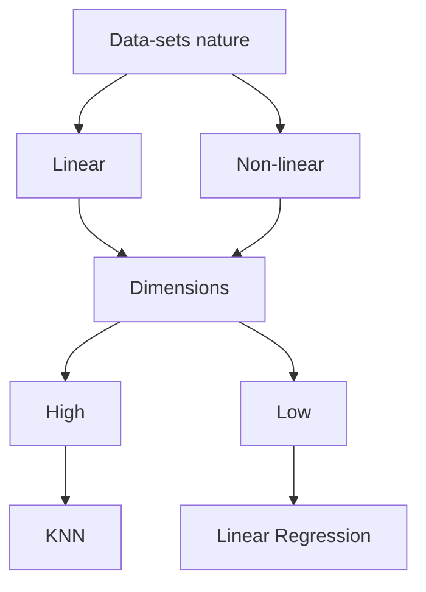

2022/07/23  (10:54)
Tag: #ml  #study/islr  [[MOC_study]]

# Ch-3 Linear Regression
Its mostly used for predicting QUANTITATIVE responses.
It is a *PARAMETRIC approach* due to the fact that it assumes linearity.
## 3.1 Simple Linear Regression:
$$
Y=\beta_{0}+\beta_1X----(3.1)
$$
X: predictor
Y: response
$\beta_{0}, \beta_1$: Model parameters.
Once we 've gotten our $\beta_{0}$ and $\beta_{1}$ (estimated them), we can get future predictions. Usually shown as:
$$
\hat y=\hat \beta_{0}+ \hat \beta_{1}x----(3.2)
$$

- [[3.1.1 ESTIMATING THE COEFFICIENTS]]
- [[3.1.2 ASSESSING THE ACCURACY OF COEFFICIENT ESTIMATES]]
- [[3.1.3 ASSESSING THE ACCURACY OF THE  MODEL]]

## 3.2 Multiple Regression:
$$
Y=\beta_0+\beta_1{X_1}+.....+\beta_p{X_p}+\epsilon----(3.11)
$$
with Xj as the jth predictor and $\beta_j$ as the quantifier of the association between that variable and the response.
>βj as the average effect on Y of a one unit increase in Xj , holding all other predictors fixed

- [[3.2.1 ESTIMATING THE REGRESSION COEFFICIENTS]]
- [[3.2.2 SOME IMPORTANT QUESTIONS]]

## 3.3. OTHER CONSIDERATIONS IN THE REGRESSION MODEL:
- [[3.3.1 QUALITATIVE PREDICTORS]]
- [[3.3.2 EXTENSIONS OF THE LINEAR MODEL]]
- [[3.3.3 POTENTIAL PROBLEMS]]

## 3.4 Comparison of Linear Regression with K-Nearest Neighbors:
This is a *NON-PARAMETRIC METHOD*.

>Given a value for K and a prediction point $x_0$, KNN regression identifies the K training observations that are closest to $x_0$ --> represented by $N_0$. it then estimates $f(x_{0})$ using the average of all the training responses.
>$$
\hat{f}(x_0)=\frac{1}{K}\sum\limits_{x_{i}\epsilon N_0}y_i----(3.19)
$$

The more the value of K increases the smoother the plot gets due to more averages.
The optimal value for K depends on the [[2.2.2 BIAS-VARIANCE TRADE-OFF]].

##### Point to note:
KNN vs Linear regression follows this ideology:

So, it's imperitive to check the dimension of the problem (i.e., the number of the predictors, or the function that we took on!)

>[!important]
>This phenomenon where the KNN performs poorly over linear regression even though the dimension of the prediction function increases is called **CURSE OF DIMENSIONALITY**. It happens due to the dataset suddenly loosing almost all *nearby neighbors*. #CurseofDimensionality

![[Pasted image 20220807211620.png]]

---
# References

[An Introduction To Statistical Learning With Applications In R (Second Edition) (Gareth James, Daniela Witten, Trevor Hastie etc.) (z-lib.org).pdf](file:///C:/Users/Anushtup%20Nandy/OneDrive/Documents/BITS/important%20stuff/EXTRA%20BOOKS/Machine%20Learning/An%20Introduction%20To%20Statistical%20Learning%20With%20Applications%20In%20R%20(Second%20Edition)%20(Gareth%20James,%20Daniela%20Witten,%20Trevor%20Hastie%20etc.)%20(z-lib.org).pdf)

