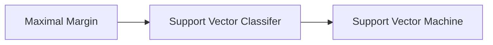

2022/08/14  (11:50)
Tag: #ml #supervised [[MOC_study]] #study/islr 

# Ch-9 Support Vector Machines
Support vector machine is a generalization of the simple classifier known as **MAXIMAL MARGIN CLASSIFER**. Although it's simple, it cannot be used in any setting other than where the datasets are linearly seperated.

## 9.1 Maximal Margin Classifier:
It uses a simple concept of *HYPERPLANE* and optimal seperation between them.

- [[9.1.1 WHAT'S A HYPERPLANE]]
- [[9.1.2 CLASSIFICATION USING A SEPERATING HYPERPLANE]]
- [[9.1.3 THE MAXIMAL MARGIN CLASSIFIER]]
- [[9.1.4 CONTRUCTION OF THE MAXIMAL MARGIN CLF]]
- [[9.1.5 NON-SEPERABLE CASE]]

## 9.2 Support Vector Classifier:
![[Pasted image 20220816001232.png]]
We cannot apply the maximal margin scenario here for various reasons, one of which is obv as:
- no hard line that'll seperate the observations.
Hence, we consider a classifier based on hyperplanes only, but now it does not perfectly seperate the 2 classes, rather;
1. great robustness to individual obs
2. better classification of *most* of the training obs

>this is the basics for the SUPPORT VECTOR CLASSIFIER or the SOFT MARGIN CLASSIFIER.
>The margin is soft because it can be violated by some of the training observations.

Observations on the wrong side of the hyperplane correspond to training observations that are misclassified by the support vector classifier.

- [[9.2.1 DETAILS OF THE SUPPORT VECTOR CLASSIFIER]]

## 9.3 Support Vector Machine:

-[[9.3.1 CLASSIFICATION WITH NON-LINEAR DECISION BOUNDARIES]]

## 9.4 SVMs with more than 2 classes:
the 2 most popular ones are 
- [[9.4.1 ONE VS ONE CLASSIFICATION]] 
- [[9.4.2 ONE VS ALL CLASSIFICATION]]

## 9.5 Relationship with Logistic Regression:

---
# References
[An Introduction To Statistical Learning With Applications In R (Second Edition) (Gareth James, Daniela Witten, Trevor Hastie etc.) (z-lib.org).pdf](file:///C:/Users/Anushtup%20Nandy/OneDrive/Documents/BITS/important%20stuff/EXTRA%20BOOKS/Machine%20Learning/An%20Introduction%20To%20Statistical%20Learning%20With%20Applications%20In%20R%20(Second%20Edition)%20(Gareth%20James,%20Daniela%20Witten,%20Trevor%20Hastie%20etc.)%20(z-lib.org).pdf)
